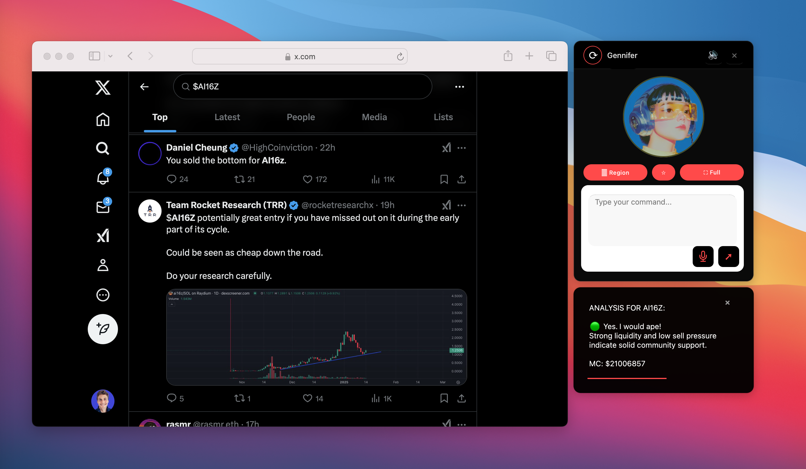

# TankWork


## Overview
TankWork is an open-source desktop agent framework that enables AI to perceive and control your computer through computer vision and system-level interactions. Agents can:

* Control your computer directly through voice or text commands
* Process real-time screen content using computer vision and expert skill routing
* Interact through natural language voice commands and text input
* Provide continuous audio-visual feedback and action logging
* Switch seamlessly between assistant and computer control modes

Built for developers and researchers working on autonomous desktop agents, TankWork combines advanced computer vision, voice processing, and system control to create AI agents that can truly understand, analyze, and interact with computer interfaces.

## Key Features
- 🎯 Direct Computer Control - Voice and text command execution
- 🔍 Computer Vision Analysis - Real-time screen processing
- 🗣️ Voice Interaction - Natural language with ElevenLabs
- 🤖 Customizable Agents - Configurable personalities and skills
- 📊 Real-time Feedback - Audio-visual updates and logging

## System Requirements
- **Recommended Platform**: macOS with Apple Silicon (M1, M2, M3, M4) for optimal computer-use capabilities
- **Python Version**: 3.12 or higher
- **Windows Support**: Coming soon
- **Display Settings**: Computer-use is more accurate with a clean desktop

## Quick Installation

### 1. Prerequisites
- Install Anaconda [here](https://www.anaconda.com/download) (recommended for dependency management)
- Terminal/Command Prompt access

### 2. Clone Repository
```bash
# Clone repository
git clone https://github.com/AgentTankOS/tankwork.git
cd tankwork
```

### 3. Install Dependencies
```bash
# Install required packages
pip install --upgrade pip setuptools wheel
pip install -r requirements.txt
```

### 4. Configure Environment
Create a `.env` file in the project root:
```bash
# Copy example environment file
cp .env.example .env
```

Add your API keys and settings to `.env`:
```env
# Required API Keys
GEMINI_API_KEY=your_api_key
OPENAI_API_KEY=your_api_key
ELEVENLABS_API_KEY=your_api_key
ANTHROPIC_API_KEY=your_api_key

# Voice Settings
ELEVENLABS_MODEL=eleven_flash_v2_5

# Computer Use Settings
COMPUTER_USE_IMPLEMENTATION=tank
COMPUTER_USE_MODEL=claude-3-5-sonnet-20241022
COMPUTER_USE_MODEL_PROVIDER=anthropic

# Narrative Processor
NARRATIVE_LOGGER_NAME=ComputerUse.Tank
NARRATIVE_MODEL=gpt-4o
NARRATIVE_TEMPERATURE=0.6
NARRATIVE_MAX_TOKENS=250

# Logging
LOG_LEVEL=INFO
```

### 5. Launch Application
```bash
python main.py
```

## Features

### Computer Use Mode
- Command-based computer control through text input or voice commands
- Advanced voice intent recognition for natural command interpretation
- Executes direct computer operations based on user commands
- Real-time voice narration of command execution
- Live action logging with visual status updates
- Continuous feedback through both audio and text channels


### Assistant Mode
- Trigger via "Select Region" or "Full Screen" buttons, or voice commands
- Features voice intent determination system
- Real-time screen/vision analysis with expert skill routing
- Default Skill: Ticker Analysis
- Provides intelligent observation and advice based on screen content
- Live voice narration of analysis results
- Dynamic text logging of observations and insights



### Voice Command System
- Voice intent determination for both Assistant and Computer Use modes
- Natural language processing for command interpretation
- Seamless switching between modes using voice commands
- Voice-activated ticker analysis and computer control
- Real-time audio feedback and confirmation

Example Commands:
1. Assistant Mode (triggers automatic screenshot + skill like Ticker Analysis):
   - "What do you think about this token?"
   - "Should I buy this token?"
   - "Is this a good entry point?"

2. Computer Use Mode (triggers direct actions):
   - "Go to Amazon"
   - "Open my email"
   - "Search for flights to Paris"

### Real-Time Feedback System
  - Live voice narration of all agent actions and analyses
  - Dynamic text action logging with visual feedback
  - Continuous status updates and command confirmation
  - Immersive audio-visual user experience


## Agent Configuration

### Pre-configured Agents

TankWork comes with four pre-configured agents, each with distinct personalities and specializations. You can add new agents and customize all agents.


#### 1. Gennifer
- **Role**: Lead Crypto Analyst
- **Voice ID**: 21m00Tcm4TlvDq8ikWAM
- **Theme Color**: #ff4a4a
- **Specialization**: Fundamental crypto metrics, community analysis
- **Analysis Style**: Focuses on sustainable growth patterns and risk management
- **Tone**: Clear, educational, encouraging


#### 2. Twain
- **Role**: Narrative Specialist
- **Voice ID**: g5CIjZEefAph4nQFvHAz
- **Theme Color**: #33B261
- **Specialization**: Content creation and storytelling
- **Analysis Style**: Evaluates narrative structure and engagement
- **Tone**: Engaging, story-focused, balanced


#### 3. Cody
- **Role**: Technical Web3 Architect
- **Voice ID**: cjVigY5qzO86Huf0OWal
- **Theme Color**: #4a90ff
- **Specialization**: Blockchain development and architecture
- **Analysis Style**: Technical implementation and security analysis
- **Tone**: Technical but approachable, systematic


#### 4. Art
- **Role**: Creative AI Specialist
- **Voice ID**: bIHbv24MWmeRgasZH58o
- **Theme Color**: #F7D620
- **Specialization**: Digital art and design innovation
- **Analysis Style**: Aesthetic quality and creative innovation
- **Tone**: Imaginative and expressive


### Agent Customization

New agents can be added and all agents can be fully customized through the configuration system:

```python
AVATAR_CONFIG = {
    "agent_id": {
        "name": str,
        "image_path": str,  # Path to static avatar image
        "video_path": str,  # Path to avatar video animation
        "voice_id": str,    # ElevenLabs voice ID
        "accent_color": str,  # Hex color code for UI theming
        "prompts": {
            "personality": str,  # Core personality traits
            "analysis": str,     # Analysis approach and focus
            "narrative": str     # Communication style and tone
        },
        "skills": List[str]  # Available skill sets
    }
}
```

#### Customizable Elements
1. **Visual Identity**
   - Static avatar image
   - Animated video avatar
   - UI accent color scheme

2. **Voice Configuration**
   - ElevenLabs voice ID selection
   - Voice model parameters

3. **Behavioral Settings**
   - Personality prompt templates
   - Analysis frameworks
   - Narrative style guidelines

4. **Skill Configuration**
   - Assignable skill sets
   - Analysis parameters
   - Specialization focus
   

## Contributing
Contributions are welcome! Please read our [Contributing Guidelines](CONTRIBUTING.md) for details on how to submit pull requests, report issues, and contribute to the project.

## License
This project is licensed under the [MIT License](LICENSE) - see the LICENSE file for details.
